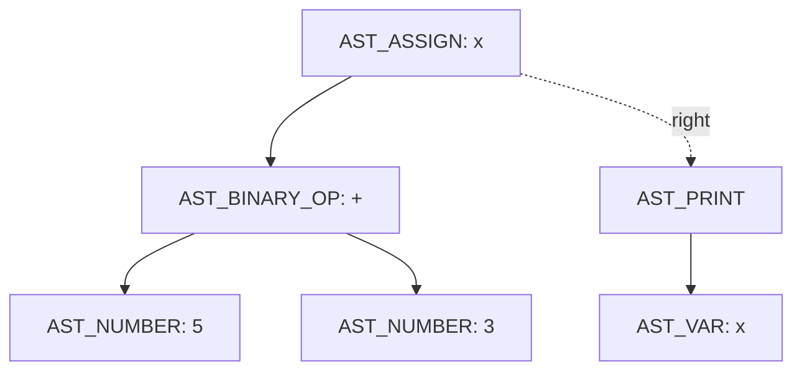

# Relatório — Análise do Mini C Compiler

## 1. Identificação do estudante

- **Nome:** Andreia Tiveron
- **Disciplina:** Compiladores
- **Atividade:** Análise Individual — Mini C Compiler
- **Data de entrega:** 21/08/2026

## 2. Identificação do projeto original

- **Repositório analisado:** [ironrinox/mini-c-compiler](https://github.com/ironrinox/mini-c-compiler)
- **Autor original:** Rino Di Paola
- **Licença:** MIT License (Copyright (c) 2025 Rino Di Paola)
- **Descrição:** compilador educacional escrito em C puro, sem dependências externas, composto por lexer, parser e interpretador para uma linguagem de brinquedo com declaração de variáveis (`let`), impressão (`print`), números inteiros, identificadores e os operadores `+ - * /`.

Os créditos e a licença original foram preservados nesta entrega (arquivo `LICENSE`).

## 3. Objetivo da atividade

O objetivo não foi apenas compilar e executar o projeto, mas acompanhar tecnicamente o caminho de um programa desde o arquivo-fonte até o resultado, relacionando cada etapa (léxica, sintática, construção de AST, interpretação) aos conceitos da disciplina de Compiladores, identificando limitações reais do código e implementando uma melhoria individual testável.

## 4. Preparação do ambiente

Ambiente utilizado:

```
$ git --version
$ gcc --version
```

Ambos disponíveis. O projeto foi obtido via clone do repositório original e depois reorganizado nesta entrega individual, preservando a estrutura `src/`, `include/`, `examples/`.

## 5. Procedimento de compilação e execução

Compilação (comando exato indicado pelo autor original):

```
gcc src/main.c src/lexer.c src/parser.c src/interpreter.c src/utils.c -Iinclude -o mini-c
```

A compilação com `gcc` padrão ocorre **sem erros**. Repetindo a compilação com `-Wall -Wextra` (não exigida, mas útil para análise crítica), surgem avisos relevantes que foram usados nesta análise:

```
src/lexer.c: In function 'print_tokens':
warning: enumeration value 'T_LPAREN' not handled in switch [-Wswitch]
warning: enumeration value 'T_RPAREN' not handled in switch [-Wswitch]
```

Isso mostra que a função `print_tokens` (em `src/lexer.c`) não trata os tipos `T_LPAREN`/`T_RPAREN` no seu `switch`. O lexer **tokeniza** parênteses corretamente — o parser os recebe e usa — mas eles simplesmente não aparecem na listagem impressa de tokens, o que é uma falha cosmética de depuração, não um erro funcional. Isso foi confirmado experimentalmente no teste T05 (Etapa 9), onde os tokens `LPAREN`/`RPAREN` de `print((10 + 5);` não aparecem na saída, apesar de estarem sendo usados corretamente pelo parser.

Execução:

```
./mini-c examples/test.txt
```

Saída obtida (código-fonte, tokens, AST e resultado, nessa ordem — ver `evidencias/test.txt`):

```
Source code:
let x = 5 + 3;
let y = 1 + 1;
print(x + y);

Program output:
10
```

## 6. Arquitetura e responsabilidades dos arquivos

| Arquivo | Responsabilidade principal | Principais funções |
| --- | --- | --- |
| `src/main.c` | Coordena o pipeline completo | `main` |
| `src/utils.c` | Lê o conteúdo do arquivo-fonte | `read_file` |
| `include/lexer.h` | Define `TokenType`, `Token`, `TokenList` | — |
| `src/lexer.c` | Converte caracteres em tokens | `lex`, `create_token`, `print_tokens` |
| `include/parser.h` | Define `ASTNodeType` e a struct `ASTNode` | — |
| `src/parser.c` | Constrói e imprime a AST | `parse`, `parse_statement`, `parse_expression`, `parse_term`, `parse_factor`, `create_node`, `print_ast` |
| `include/interpreter.h` | Define `Symbol`, `SymbolTable` e assinaturas do interpretador | — |
| `src/interpreter.c` | Percorre a AST e executa o programa | `init_symbol_table`, `lookup_symbol`, `set_symbol`, `eval_expression`, `exec_statement`, `interpret` |
| `examples/test.txt` | Programa de exemplo original | — |

(`parse_term` e `parse_factor` foram adicionadas por mim como parte da melhoria individual, descrita na Seção 17.)

## 7. Análise do ponto de entrada (`src/main.c`)

```c
int main(int argc, char* argv[]) {
    if (argc < 2) {
        fprintf(stderr, "Error: No source file specified.\n");
        ...
        return EXIT_FAILURE;
    }
    char* source_code = read_file(argv[1]);
    printf("Source code:\n%s\n\n", source_code);

    TokenList tokens = lex(source_code);
    ...
    ASTNode* ast = parse(&tokens);
    ...
    interpret(ast);

    free(source_code);
    return 0;
}
```

Respostas às perguntas obrigatórias:

1. **Como o caminho do arquivo-fonte é recebido?** Pelo primeiro argumento de linha de comando, `argv[1]`.
2. **O que acontece quando nenhum arquivo é informado?** `argc < 2` é verdadeiro; o programa imprime uma mensagem de erro em `stderr` e retorna `EXIT_FAILURE` (1), **sem** chamar `exit()` diretamente — é um retorno controlado de `main`. Testado (`evidencias`):
   ```
   $ ./mini-c
   Error: No source file specified.
   Please provide the path to the source code file when running the program.
   Example usage: ./mini-c examples/test.txt
   $ echo $?
   1
   ```
3. **Qual função lê o arquivo?** `read_file`, em `src/utils.c`.
4. **Qual função realiza a análise léxica?** `lex`, em `src/lexer.c`.
5. **Qual função constrói a AST?** `parse`, em `src/parser.c`.
6. **Qual função executa a AST?** `interpret`, em `src/interpreter.c`.
7. **Em que ordem essas funções são chamadas?** `read_file` → `lex` → `parse` → `interpret`, estritamente sequencial: cada etapa consome o resultado da anterior e nenhuma delas roda em paralelo ou é intercalada.

## 8. Análise da leitura do arquivo (`src/utils.c`)

```c
char* read_file(const char* filename) {
    FILE* file = fopen(filename, "r");
    if (!file) { perror("Error opening file"); exit(EXIT_FAILURE); }

    fseek(file, 0, SEEK_END);
    long length = ftell(file);
    rewind(file);

    char* buffer = malloc(length + 1);
    ...
    size_t read_size = fread(buffer, 1, length, file);
    buffer[read_size] = '\0';

    fclose(file);
    return buffer;
}
```

- **Por que é necessário reservar memória?** O tamanho do arquivo só é conhecido em tempo de execução (via `fseek`/`ftell`), então o buffer não pode ser uma variável estática de tamanho fixo; é alocado dinamicamente com `malloc(length + 1)`, sendo o `+1` reservado para o terminador de string.
- **Qual é o papel do caractere `\0`?** Em C, strings não têm um campo de tamanho embutido — o `\0` marca onde a string termina. Sem ele, funções como `strcmp`/`strlen` (usadas no lexer) leriam memória além do conteúdo do arquivo, causando comportamento indefinido.
- **O que acontece quando o arquivo não existe?** `fopen` retorna `NULL`; o `if (!file)` captura isso, chama `perror` (que imprime a mensagem de erro do sistema) e encerra o programa com `exit(EXIT_FAILURE)`. Testado:
  ```
  $ ./mini-c examples/arquivo_inexistente.txt
  Error opening file: No such file or directory
  $ echo $?
  1
  ```
- **Quem libera a memória reservada?** `main`, através de `free(source_code)` — mas **somente** se o programa chegar ao fim normalmente. Como `lex`, `parse` e `interpret` chamam `exit(1)` diretamente em vários pontos de erro, esse `free` é pulado nesses casos. Isso não causa problema visível (o processo termina e o SO libera toda a memória), mas é uma prática que um compilador mais rigoroso trataria com mais cuidado (ex.: tratamento de erro sem `exit()` abrupto).

## 9. Análise léxica (`include/lexer.h` e `src/lexer.c`)

Tokens definidos no `enum TokenType`:

```
T_NUMBER, T_PLUS, T_MINUS, T_MULT, T_DIV, T_LET, T_IDENTIFIER,
T_EQUAL, T_PRINT, T_SEMICOLON, T_LPAREN, T_RPAREN, T_EOF
```

### 9.1 Teste léxico obrigatório

**Teste 01 — válido** (`testes/01_lexico_valido.txt`):
```
let valor1 = 123 + 4;
print(valor1);
```
Tokens gerados:
```
LET
IDENT(valor1)
EQUAL
NUMBER(123)
PLUS
NUMBER(4)
SEMICOLON
PRINT
IDENT(valor1)
SEMICOLON
EOF
```

**Teste 02 — inválido** (`testes/02_lexico_invalido.txt`):
```
let valor = 10 @ 2;
```
Saída obtida:
```
Unknown character: @
```
com código de saída `1`.

- **Caractere que causou o erro:** `@`
- **Arquivo e função responsáveis pela detecção:** `src/lexer.c`, função `lex`, no `default:` do `switch (c)` que trata operadores/pontuação.
- **Classificação do erro:** erro **léxico** — o token `@` não corresponde a nenhum padrão reconhecido pelo analisador léxico; o erro é detectado antes mesmo de existir uma lista de tokens completa ou uma AST.

### 9.2 Perguntas obrigatórias

1. **Como o lexer diferencia `let` de um identificador comum?** Ele não diferencia na hora de ler os caracteres — ambos são lidos pelo mesmo laço `while (isalnum(source[i]) && j < 31)`. A diferenciação ocorre **depois**, comparando a palavra lida com `strcmp(buffer, "let")`/`strcmp(buffer, "print")`. Se bater, gera token de palavra reservada; senão, `T_IDENTIFIER`.
2. **Como um número com vários dígitos é construído?** Pelo laço `while (isdigit(source[i])) { value = value*10 + (source[i]-'0'); i++; }`, que acumula dígito a dígito (ex.: "123" → 1 → 12 → 123).
3. **Identificadores como `nota1` são aceitos?** Sim. Depois do primeiro caractere (`isalpha`), o laço aceita `isalnum`, então dígitos após letras são permitidos.
4. **Identificadores iniciados por número são aceitos como um único token?** Não. Testei com `1abc`:
   ```
   let 1abc = 5;
   ```
   Tokens: `LET NUMBER(1) IDENT(abc) EQUAL NUMBER(5) SEMICOLON EOF`. O lexer entra primeiro no ramo `isdigit`, consome só o `1` como `NUMBER`, e o restante (`abc`) vira um `IDENTIFIER` **separado**. Ou seja, `1abc` nunca é um erro léxico — é silenciosamente fatiado em dois tokens, o que gera erro **sintático** mais adiante (`parse_statement` espera um `=` logo após o nome da variável, mas encontra `IDENT(abc)`). Isso revela uma segunda falha: `parse_statement` também não valida se o token após `let` é de fato um `T_IDENTIFIER` — ele simplesmente assume `tokens->tokens[*pos]` como o nome da variável, mesmo que seja um `NUMBER`.
5. **O lexer registra linha e coluna?** Não. A struct `Token` só tem `type`, `value` e `name`; não há nenhum campo de posição (linha/coluna). Mensagens de erro do lexer usam apenas o caractere; mensagens de erro do parser usam a posição no **array de tokens** (`pos`), não posição no texto-fonte.
6. **Existe limite para a quantidade de tokens?** Sim: `list.tokens = malloc(128 * sizeof(Token))`. O comentário no código diz "initial size, can grow", mas **não existe** nenhuma chamada a `realloc` em nenhum lugar de `lex`.
7. **O que pode ocorrer se o programa gerar mais de 128 tokens?** Estouro de buffer (heap buffer overflow): `list.tokens[list.count++] = ...` escreveria além da região alocada, causando comportamento indefinido — na prática, corrupção de memória silenciosa ou crash, dependendo do alocador. Não é capturado nem reportado como erro.

## 10. Análise sintática (`src/parser.c`)

Funções centrais: `parse`, `parse_statement`, `parse_expression` (e, após a melhoria individual, `parse_term`/`parse_factor` — ver Seção 17).

Formas reconhecidas:
```
let IDENTIFICADOR = EXPRESSAO ;
print ( EXPRESSAO ) ;
NUMERO | IDENTIFICADOR | ( EXPRESSAO ) | EXPRESSAO OPERADOR EXPRESSAO
```

### 10.1 Testes sintáticos obrigatórios

| Arquivo | Entrada | Resultado esperado | Resultado observado | Mensagem | Posição (pos) | Função detectora |
| --- | --- | --- | --- | --- | --- | --- |
| `03_sintatico_valido.txt` | `let resultado = (10 + 5) * 2; print(resultado);` | Executa, imprime 30 | Executa, imprime `30` | — | — | `parse` / `interpret` |
| `04_sem_igual.txt` | `let resultado 10 + 5;` | Erro sintático | Erro, exit 1 | `Syntax error: expected '=' at pos=2` | 2 | `parse_statement` |
| `05_sem_ponto_virgula.txt` | `let resultado = 10 + 5` | Erro sintático | Erro, exit 1 | `Syntax error: expected ';' at pos=6` | 6 (token `EOF`) | `parse_statement` |
| `06_parentese_incompleto.txt` | `print((10 + 5);` | Erro sintático | Erro, exit 1 | `Syntax error: expected ')' at pos=7` | 7 (token `SEMICOLON`) | `parse_factor` (antes da melhoria: `parse_expression`) |

Todas as posições reportadas são índices **no array de tokens**, não linha/coluna do texto-fonte — coerente com a ausência de rastreamento posicional já observada no lexer (Seção 9.2, pergunta 5).

## 11. Análise da AST (`include/parser.h`)

```c
typedef enum {
    AST_NUMBER, AST_BINARY_OP, AST_VAR, AST_ASSIGN, AST_PRINT
} ASTNodeType;

typedef struct ASTNode {
    ASTNodeType type;
    int value;
    char name[32];
    struct ASTNode* left;
    struct ASTNode* right;
} ASTNode;
```

Para `let x = 5 + 3; print(x);`, a AST impressa é:

```
AST_ASSIGN(x)
  AST_BINARY_OP(+)
    AST_NUMBER(5)
    AST_NUMBER(3)
AST_PRINT
  AST_VAR(x)
```



- **Qual nó representa a atribuição?** `AST_ASSIGN`.
- **Onde o nome `x` é armazenado?** No campo `name[32]` do próprio nó `AST_ASSIGN` (reaproveitado também por `AST_VAR`).
- **Quais nós representam os números?** `AST_NUMBER`, um para `5` e outro para `3`, cada um guardando o valor no campo `value`.
- **Qual nó representa a soma?** `AST_BINARY_OP`, com o caractere do operador (`'+'`) guardado — de forma um tanto inusitada — também no campo `value` (reaproveitado como `int`, já que um `char` cabe em um `int`).
- **Como os ponteiros `left`/`right` são usados?**
  - Em `AST_BINARY_OP`: `left` e `right` são os dois operandos da operação.
  - Em `AST_ASSIGN`/`AST_PRINT`: `left` guarda a expressão (o valor a atribuir ou a imprimir); `right` é `NULL` nesse papel.
  - **Entre statements diferentes**, porém, `right` é reaproveitado com um significado totalmente diferente: ele encadeia o **próximo comando** do programa (ver `parse`, que percorre `temp->right` até achar `NULL` para anexar o próximo statement, formando uma lista "enviesada à direita"). Ou seja, o mesmo ponteiro `right` significa "segundo operando" em `AST_BINARY_OP` e "próximo comando" em `AST_ASSIGN`/`AST_PRINT` — uma sobrecarga de significado que só funciona porque cada tipo de nó nunca usa as duas coisas ao mesmo tempo.

## 12. Tabela de símbolos e interpretação (`src/interpreter.c`)

```c
typedef struct { char name[32]; int value; } Symbol;
typedef struct { Symbol symbols[128]; int count; } SymbolTable;
```

- `interpret(root)` inicializa a tabela e percorre a lista de statements (via `current = current->right`), chamando `exec_statement` em cada um.
- `exec_statement` distingue `AST_ASSIGN` (avalia a expressão e chama `set_symbol`) de `AST_PRINT` (avalia a expressão e imprime).
- `eval_expression` é recursiva: para `AST_BINARY_OP`, avalia `left` e `right` recursivamente antes de aplicar o operador — é aqui, e não no parser, que a soma/subtração/multiplicação/divisão realmente acontece.
- `set_symbol` procura por nome; se existir, atualiza; senão, insere (se `count < 128`, senão erro de overflow **tratado**, diferente do overflow **não tratado** do array de tokens do lexer).
- `lookup_symbol` procura por nome; se não encontrar, imprime erro e chama `exit(1)`.

### 12.1 Testes obrigatórios

| Teste | Entrada | Resultado | Classificação |
| --- | --- | --- | --- |
| Variável definida | `let idade = 30; print(idade);` | Imprime `30` | Sucesso |
| Variável não definida (`07_variavel_indefinida.txt`) | `print(idade);` | `Runtime error: undefined variable 'idade'`, exit 1 | **Erro semântico detectado durante a execução** |
| Divisão por zero (`08_divisao_por_zero.txt`) | `let resultado = 10 / 0; print(resultado);` | `Runtime error: division by zero`, exit 1 | **Erro de execução (runtime)** |

**Por que a variável indefinida só é detectada pelo interpretador, e não pelo parser?** Porque o parser só verifica a **forma** do programa (a gramática): `print(idade);` é perfeitamente válido sintaticamente — `idade` é um `T_IDENTIFIER` em posição de expressão, e `parse_factor`/`parse_expression` aceitam qualquer identificador sem checar se ele foi declarado. Essa checagem (existência da variável) é uma questão de **semântica**, não de sintaxe, e neste projeto ela só é feita em tempo de execução, dentro de `lookup_symbol`, quando o interpretador de fato tenta ler o valor da variável.

## 13. Compilador, interpretador ou transpiler?

**Conclusão: o projeto, em sua versão atual, é um interpretador — não um compilador nem um transpiler.**

Justificativa técnica, com base nas funções analisadas:

- Não produz nenhum arquivo de saída: `main.c` não abre nenhum `FILE*` em modo de escrita; a única saída é feita via `printf` no terminal.
- Não gera assembly nem código de máquina: em nenhum ponto de `src/parser.c` ou `src/interpreter.c` há emissão de instruções de uma arquitetura-alvo.
- Não gera bytecode: não existe nenhuma representação intermediária serializada nem uma máquina virtual que a execute.
- Não gera código em outra linguagem-fonte (o que caracterizaria um transpiler, como C→JavaScript): a única "tradução" que ocorre é da lista de tokens para a AST em memória.
- A execução ocorre diretamente sobre a AST: `interpret(root)` percorre os nós e `eval_expression` calcula os valores em C, na hora — é *tree-walking interpretation* clássica.

Isso confirma explicitamente o aviso do enunciado da atividade: apesar do nome "Mini C Compiler", o pipeline observado (`lex` → `parse` → `interpret`) é o de um **interpretador de AST**, e o próprio `README.md` do autor original reconhece isso ("Currently, the project functions as an interpreter").

## 14. Investigação de precedência e associatividade (comportamento original, antes da correção)

O parser original (antes da minha melhoria individual) implementava toda a lógica de expressão em uma única função `parse_expression`, que:
1. lia um "primário" (número, identificador ou `( expressão )`);
2. entrava em um laço único que tratava `+`, `-`, `*` e `/` **com a mesma prioridade**;
3. para o operando direito, chamava **recursivamente a própria `parse_expression`**, em vez de um parser de nível de precedência mais alto.

Isso tem duas consequências, testadas empiricamente antes da correção:

| Teste | Entrada | Esperado | Obtido (código original) | AST original | Explicação |
| --- | --- | --- | --- | --- | --- |
| A | `2 * 3 + 4` | 10 | **14** | `*` na raiz, `+` como filho direito → `2 * (3 + 4)` | Sem precedência: `*` e `+` tratados igual, e o `+` "engoliu" o resto da expressão por causa da recursão à direita |
| B | `10 - 3 - 2` | 5 | **9** | `-` na raiz, `-` como filho direito → `10 - (3 - 2)` | Associatividade à **direita**, incorreta para `-`/`/` |
| C | `2 + 3 * 4` | 14 | 14 (coincidência) | `+` na raiz, `*` como filho direito → `2 + (3 * 4)` | Coincide com o resultado correto só porque, nesse caso específico, agrupar à direita dá o mesmo resultado que respeitar a precedência real |

O Teste C **não prova que o parser está correto** — ele só não expõe o problema, porque a ordem "certa por acaso" das operações não muda o resultado. Os Testes A e B mostram claramente que o parser original **não respeitava precedência** (trata `*`/`/` e `+`/`-` como iguais) **nem associatividade à esquerda** (soma/subtração deveriam agrupar da esquerda para a direita, mas agrupavam da direita para a esquerda). Isso foi o motivo pelo qual escolhi essa falha como minha melhoria individual (Seção 15).

## 15. Melhoria individual: correção de precedência e associatividade

### 15.1 Problema escolhido

O parser (`src/parser.c`) não implementava níveis de precedência entre operadores aritméticos, e associava operadores binários à direita em vez de à esquerda, produzindo resultados matematicamente incorretos para expressões que misturam `+`/`-` com `*`/`/`, ou que encadeiam múltiplos `-`/`/`.

### 15.2 Comportamento anterior

Ver Seção 14 — `2*3+4` resultava em `14` (esperado `10`) e `10-3-2` resultava em `9` (esperado `5`).

### 15.3 Comportamento desejado

Respeitar a convenção matemática usual:
- `*` e `/` têm precedência maior que `+` e `-`;
- todos os operadores binários implementados são associativos à **esquerda**.

### 15.4 Arquivos e funções alterados

Apenas `src/parser.c` foi alterado no código do projeto original. A comparação abaixo foi feita com `diff` diretamente contra a cópia original obtida do repositório (`ironrinox/mini-c-compiler`), então a lista é exaustiva, não apenas um resumo.

**Arquivos de código modificados (1 arquivo):**

| Arquivo | Tipo de mudança |
| --- | --- |
| `src/parser.c` | Modificado — `parse_expression` original removida; três funções em seu lugar (`parse_factor`, `parse_term`, `parse_expression` reescrita) |

- A função `parse_expression` original foi **removida** (sua lógica de leitura de números/identificadores/parênteses foi movida para uma nova função).
- Três funções agora existem, refletindo três níveis de precedência (gramática clássica de descida recursiva):
  - **`parse_factor`** (nova) — trata números, identificadores e `( expressão )`. É o nível de maior precedência.
  - **`parse_term`** (nova) — trata `*` e `/`, chamando `parse_factor` para cada operando, em um **laço** (não recursão) que garante associatividade à esquerda.
  - **`parse_expression`** (reescrita) — trata `+` e `-`, chamando `parse_term` para cada operando, no mesmo padrão de laço.

Gramática resultante:
```
expression := term (('+' | '-') term)*
term       := factor (('*' | '/') factor)*
factor     := NUMBER | IDENTIFIER | '(' expression ')'
```

**Arquivos de código confirmados como idênticos ao original** (nenhuma linha alterada, verificado com `diff`): `src/main.c`, `src/utils.c`, `src/lexer.c`, `src/interpreter.c`, `include/lexer.h`, `include/parser.h`, `include/interpreter.h`, `include/utils.h`.

**Arquivos novos, criados para esta entrega (não existiam no projeto original):**

| Arquivo | Conteúdo |
| --- | --- |
| `RELATORIO.md` | Este relatório |
| `testes/01_lexico_valido.txt` | Teste léxico obrigatório (Etapa 3) |
| `testes/03_sintatico_valido.txt` | Teste sintático obrigatório (Etapa 4) |
| `testes/07_variavel_indefinida.txt` | Teste de variável não definida (Etapa 6) |
| `testes/08_divisao_por_zero.txt` | Teste de divisão por zero (Etapa 6) |
| `testes/09_precedencia_teste_a.txt` | Teste A de precedência (Etapa 8) |
| `testes/10_associatividade_teste_b.txt` | Teste B de associatividade (Etapa 8) |
| `testes/11_precedencia_teste_c.txt` | Teste C de precedência (Etapa 8) |
| `testes/12_melhoria_precedencia_mista.txt` | Teste da melhoria individual (Etapa 9) |
| `evidencias/*.txt` (13 arquivos) | Saída bruta capturada de cada execução de teste |

Os arquivos `testes/02_lexico_invalido.txt`, `testes/04_sem_igual.txt`, `testes/05_sem_ponto_virgula.txt` e `testes/06_parentese_incompleto.txt` já existiam de uma etapa anterior da minha análise e foram mantidos.

**Arquivos do projeto original que não fazem parte desta entrega:** os binários compilados (`mini-c`, `mini-c.exe` — não fazem sentido versionados, já que são gerados pelo comando de compilação) e a pasta `docs/` com as notas de desenvolvimento do autor original (não exigida pelo enunciado da atividade).

**Arquivo reescrito por completo (não é código-fonte do compilador):** `README.md` foi reescrito para descrever esta entrega específica, preservando explicitamente os créditos e a licença do projeto original (autor Rino Di Paola, licença MIT) no próprio texto.

### 15.5 Decisões de implementação

- Optei por **três funções separadas** (uma por nível de precedência) em vez de, por exemplo, uma tabela de precedência genérica, porque o projeto é pequeno (apenas 4 operadores em 2 níveis) e essa é a forma mais didática e mais próxima do estilo já usado no restante do código (recursão descendente simples, sem abstrações extras).
- Usei **laços `while`** em vez de recursão para o operando direito, exatamente para inverter o problema original: recursão no lado direito naturalmente cria associatividade à direita; laço com atualização de `left` cria associatividade à esquerda.
- Mantive a assinatura pública de `parse_expression(TokenList*, int*)` inalterada, para não exigir mudanças em `parse_statement` nem em `main.c` — a melhoria fica isolada em `src/parser.c`.
- Não alterei `create_node`, `ASTNode`, nem a representação de operadores como `char` guardado em `value` — mantive a estrutura de dados original para focar a mudança exclusivamente na lógica de parsing.

### 15.6 Casos de teste

| Arquivo | Entrada | Esperado | Antes da correção | Depois da correção |
| --- | --- | --- | --- | --- |
| `09_precedencia_teste_a.txt` | `print(2 * 3 + 4);` | 10 | 14 | **10** |
| `10_associatividade_teste_b.txt` | `print(10 - 3 - 2);` | 5 | 9 | **5** |
| `11_precedencia_teste_c.txt` | `print(2 + 3 * 4);` | 14 | 14 | **14** |
| `12_melhoria_precedencia_mista.txt` | `let x = 2*3; let y = 2*x+3; print(y/x);` | (2\*3=6; y=2\*6+3=15; 15/6=2) | `2*(x+3)` → y=18, 18/6=**3** | `(2*x)+3` → y=15, 15/6=**2** |

O último teste é especialmente relevante porque **não** é um teste inventado artificialmente: é o arquivo `examples/meuexemplo.txt`, criado por mim antes mesmo de eu saber sobre o bug, e seu resultado de fato mudou de `3` para `2` depois da correção — evidência de que a falha afetava também programas "normais", não só casos de teste extremos.

Regressão: reexecutei todos os testes anteriores (T01 a T08, Etapas 3, 4 e 6) depois da correção e todos continuaram se comportando exatamente como antes (nenhum teste que já passava foi quebrado pela mudança).

### 15.7 Resultado obtido

A correção resolve totalmente o problema de precedência entre `*`/`/` e `+`/`-`, e o problema de associatividade de `-` e `/` encadeados, sem alterar nenhum outro comportamento do interpretador (lexer, tabela de símbolos e tratamento de erros permaneceram intactos).

### 15.8 Limitações que permaneceram

- Ainda não há suporte a operador unário de menos (ex.: `-5` sozinho não é aceito, só como parte de uma subtração binária).
- O array de tokens do lexer ainda tem limite fixo de 128 sem `realloc` (Seção 9.2, pergunta 7) — não fazia parte do escopo da minha melhoria.
- A falta de rastreamento de linha/coluna (Seção 9.2, pergunta 5) permanece: os erros continuam reportando posição no array de tokens, não no texto-fonte.
- O bug de exibição em `print_tokens` (parênteses não aparecem na listagem de tokens, Seção 5) não foi corrigido, por ser cosmético e não relacionado à minha melhoria escolhida.

## 16. Casos de teste — tabela consolidada

| ID | Categoria | Entrada (arquivo) | Resultado esperado | Resultado obtido | Situação |
| --- | --- | --- | --- | --- | --- |
| T01 | Válido | `examples/test.txt` | imprime 10 | imprime 10 | Aprovado |
| T02 | Léxico | `testes/02_lexico_invalido.txt` | erro léxico (`@`) | `Unknown character: @`, exit 1 | Aprovado |
| T03 | Sintático | `testes/04_sem_igual.txt` | erro de sintaxe (`=` ausente) | `expected '=' at pos=2`, exit 1 | Aprovado |
| T04 | Sintático | `testes/05_sem_ponto_virgula.txt` | erro de sintaxe (`;` ausente) | `expected ';' at pos=6`, exit 1 | Aprovado |
| T05 | Sintático | `testes/06_parentese_incompleto.txt` | erro de sintaxe (`)` ausente) | `expected ')' at pos=7`, exit 1 | Aprovado |
| T06 | Execução | `testes/07_variavel_indefinida.txt` | erro semântico em runtime | `undefined variable 'idade'`, exit 1 | Aprovado |
| T07 | Execução | `testes/08_divisao_por_zero.txt` | erro de execução | `division by zero`, exit 1 | Aprovado |
| T08 | Expressão | `testes/09_precedencia_teste_a.txt` | 10 | 10 (após correção) | Aprovado |
| T09 | Expressão | `testes/10_associatividade_teste_b.txt` | 5 | 5 (após correção) | Aprovado |
| T10 | Extensão | `testes/12_melhoria_precedencia_mista.txt` | 2 | 2 (após correção) | Aprovado |

Evidências completas (saída bruta de cada execução) estão em `evidencias/`.

## 17. Limitações gerais encontradas no projeto

Consolidando o que foi observado ao longo da análise:

1. Sem geração de código — é interpretador, não compilador (Seção 13).
2. Sem operador de precedência antes da minha correção (Seção 14) — corrigido apenas para expressão aritmética; outros operadores futuros (relacionais, `%`) precisariam ser encaixados na mesma hierarquia.
3. Sem rastreamento de linha/coluna nos tokens (Seção 9.2).
4. Tabela de tokens com tamanho fixo (128) sem `realloc`, gerando risco real de overflow de heap em programas maiores (Seção 9.2).
5. `parse_statement` não valida o tipo do token esperado como nome de variável após `let` (Seção 9.2, pergunta 4) — assume, sem checar.
6. `print_tokens` não trata `T_LPAREN`/`T_RPAREN` no `switch`, então parênteses tokenizados corretamente não aparecem na depuração impressa (Seção 5).
7. Não há função de liberação (`free`) da AST — toda a árvore de nós alocados com `malloc` em `create_node` vaza ao final do programa (mitigado apenas pelo fato de o processo terminar em seguida).
8. Sem suporte a estruturas de controle (`if`, laços), funções, tipos além de inteiro, ou operador unário de menos.

## 18. Conclusão

A análise confirmou que o Mini C Compiler é, apesar do nome, um interpretador de AST simples e didático, com um pipeline claro e bem separado em quatro fases (leitura de arquivo, análise léxica, análise sintática/AST, interpretação). O código é compacto o bastante para ser lido e entendido por completo, o que o torna um bom material de estudo — mas também expôs, na prática, exatamente o tipo de bug sutil que a disciplina de Compiladores busca ensinar a identificar: uma gramática de expressões sem separação de precedência é sintaticamente válida (compila e "funciona"), mas produz resultados semanticamente errados. Implementar a correção (separação em `factor`/`term`/`expression`, com laços para associatividade à esquerda) foi um exercício direto de como recursão descendente materializa, na estrutura do próprio código, as regras de precedência e associatividade de uma linguagem.


## 19. Referências

IRONRINOX (Rino Di Paola). **Mini C Compiler**. GitHub. Disponível em: <https://github.com/ironrinox/mini-c-compiler>. Acesso em: 20 ago. 2026.

DI PAOLA, Rino. *How I Built a Mini C Compiler to Understand How Compilers Work*. DEV Community, 2025. Disponível em: <https://dev.to/ironrinox/how-i-built-a-mini-c-compiler-to-understand-how-compilers-work-1jb7>.
